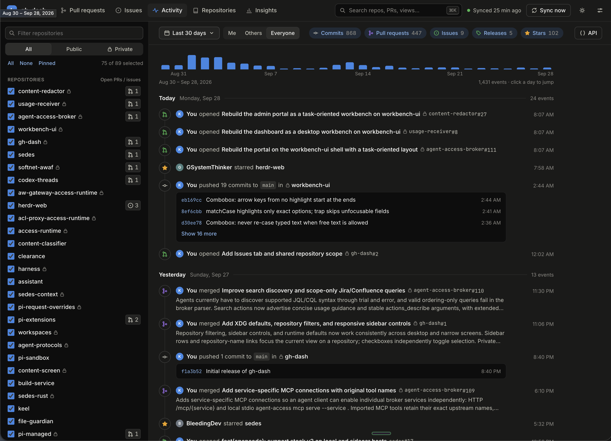
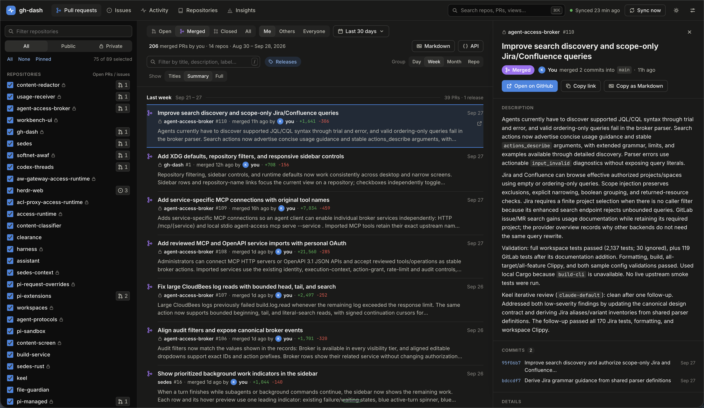
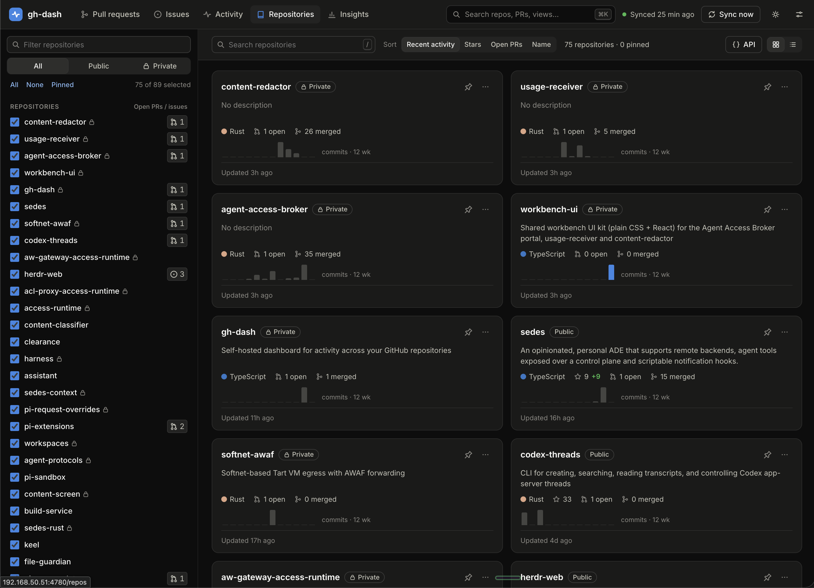
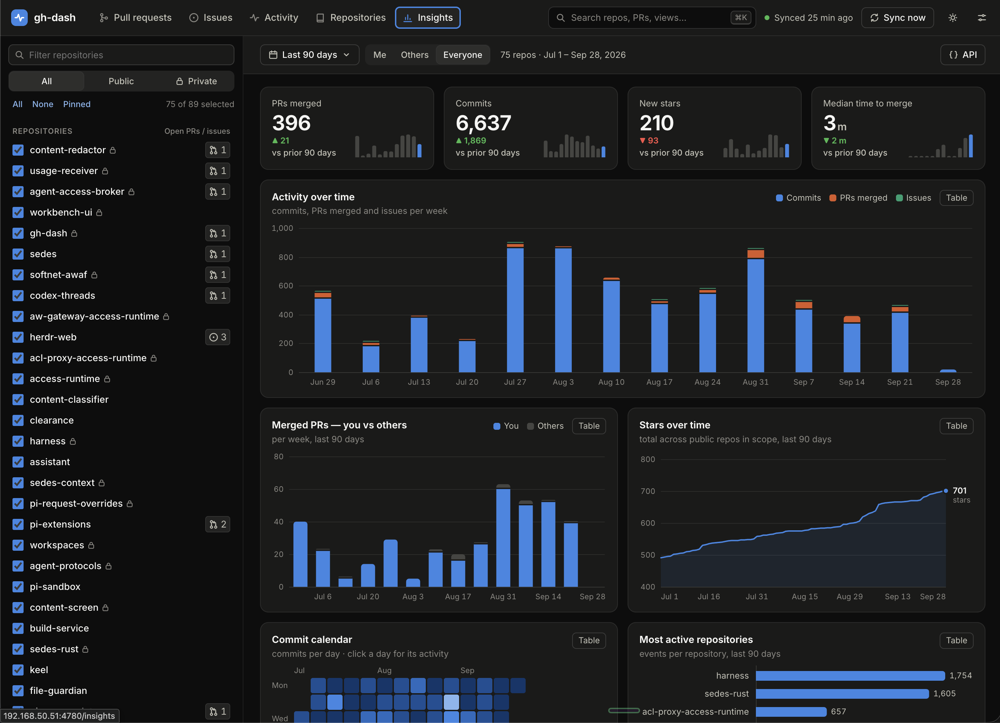

# gh-dash

A self-hosted dashboard for activity across your own GitHub and GitLab repositories. Browse
pull requests (merge requests on GitLab) and their descriptions, follow commits, issues,
releases and stars, and see trends over time. Filter by repository, date, visibility or
contributor.

gh-dash syncs to a local database for fast browsing. It reads from GitHub and GitLab
without changing your repositories.



<table>
  <tr>
    <td><a href="docs/images/pull-requests.png"></a></td>
    <td><a href="docs/images/repositories.png"></a></td>
    <td><a href="docs/images/insights.png"></a></td>
  </tr>
  <tr>
    <td align="center">Pull requests</td>
    <td align="center">Repositories</td>
    <td align="center">Insights</td>
  </tr>
</table>

## Getting started

You need **Node.js 22.13 or newer** and a GitHub token with read access to your repositories.
For a fine-grained token, choose **All repositories** and grant **Metadata**, **Contents**,
**Pull requests** and **Issues** read access. Set it in the `GITHUB_TOKEN` environment
variable or a token file (`GITHUB_TOKEN_FILE`), or sign in with `gh auth login` if you use
the GitHub CLI. To follow GitLab projects too, see [GitLab and other sources](#gitlab-and-other-sources).
For a desktop window instead of a server, see [Desktop app](#desktop-app).

From the project directory:

```sh
npm ci
npm run build
npm start
```

Open **http://127.0.0.1:4780**. The first sync starts automatically and fetches the
last year of activity; progress appears in the header. Repositories owned by the
signed-in user are synced automatically; add others by hand (see below).

## Using the dashboard

- **Pull requests:** read descriptions, filter by state, and open a detail drawer.
- **Diffs:** open a PR's changes with **Files changed** in its drawer, or click a commit's SHA
  in the drawer or Activity (modifier-click still opens the code host). Diffs are fetched from
  GitHub or GitLab on demand and cached on the server; see **Settings → Diff cache** for its size limit and to clear it.
- **Issues:** browse open or closed issues, expand descriptions, and filter by creator, repository, or date.
- **Activity:** browse a combined timeline and jump to a day using the activity strip.
- **Repositories and Insights:** explore repository activity, contributors and trends.
- **Other owners' repositories:** to follow an organization's repository or a project you
  contribute to, use **Add repository** (the **+** in the sidebar, the Repositories page,
  **Settings → Tracked repositories**, or the command palette). Pick one of the repositories
  the token can read, or paste `owner/name` or a GitHub URL; gh-dash checks the token's access
  and shows what the first sync will fetch before you add it. With a GitLab source, a small
  picker chooses where to look (it starts on the current source); paste `group/project`, a
  project URL or `host/group/project`, and an address of another source switches the picker.
  **Remove…** in a repository's menu stops syncing it and deletes its data from the
  dashboard; nothing changes on GitHub or GitLab.
  A fine-grained token reads private repositories of a single owner only; a classic token or
  the GitHub CLI can read every organization you belong to.
- **Keyboard shortcuts:** `Ctrl/Cmd+K` opens search; `/` focuses the filter. In the PR
  list, use `j`/`k` to move, `Enter` to open details, `d` to view the diff, and `Esc` to close.

Use **Settings** to adjust the sync interval, backfill window and fork inclusion.
Add any unlinked commit emails under **My commit emails** so those commits count as yours.
Click a sidebar repository row to focus on it; use its checkbox to add or remove it
from your selection. The selection applies to Pull requests, Issues, Activity,
Repositories, and Insights, and carries across tabs. The sidebar's **All** returns to the
default selection: every repository except archived, hidden and forked ones (**Hide from
default selection** in a repository's menu leaves one out). Expand **Show inactive** to select
archived, hidden, or forked repositories explicitly. **All / Mine / Others** shows every
repository, the ones you own, or the ones you added; the filter button next to the search
box narrows them by visibility. Sidebar badges show nonzero open PR and issue counts as of the last sync.
Click repository names in lists and activity to filter to them. Drag the sidebar's
divider to resize it; its width is saved in your browser. You can also focus the
divider and use arrow keys, or double-click it to reset the width. To make more room,
hide the sidebar with the sidebar button at the top left or `[`; your browser remembers
whether it's shown.
On narrow screens, the sidebar starts closed. Use the sidebar button to open it
full screen, then choose a repository or tap Close to return to the list. PR details
and diffs also use the full content area on narrow screens; close them to return to the list.
Mobile filter bars start as a single summary row; tap Filters to expand or collapse the controls.

## Configuration and deployment

Settings come from environment variables, which can also be set in
`$XDG_CONFIG_HOME/gh-dash/env` (default `~/.config/gh-dash/env`) as `KEY=value` lines.
Shell expansion is not performed there; use absolute paths.

They can also live in a JSON file, `$XDG_CONFIG_HOME/gh-dash/config.json` (or the path in
`GH_DASH_CONFIG`). Its keys mirror the variables: `host`, `port`, `allowedHosts`, `db`,
`cacheDb`, `sync`, `password`, `apiKey`, `myEmails`, `timezone` (`TZ`), `tokenSource`,
`tokenFile`, `ghPath`, `glabPath` and `sources` (GitLab sources, below). Lists are arrays and
`sync` is a boolean; `null` clears `password`, `apiKey`, `tokenFile`, `ghPath` and `glabPath`:

```json
{ "port": 4780, "db": "/srv/gh-dash/gh-dash.db", "allowedHosts": ["dash.example.com"], "tokenFile": "/etc/gh-dash/github-token" }
```

Precedence, lowest first: defaults, `config.json`, the env file, then process environment
variables. A variable that is set wins even when empty. Unknown keys are logged and ignored;
invalid values stop the server with a message naming the file. `GET /api/v1/instance` shows
each effective setting and where it came from. Restart after edits, and keep files that
contain credentials private (`chmod 600`); gh-dash warns about a readable `config.json`
that holds a password or API key.

| Environment variable | Default | Purpose |
| --- | --- | --- |
| `GITHUB_TOKEN` | Unset | Read-only GitHub access; wins over every other token source |
| `GITHUB_TOKEN_FILE` | Unset | A file holding just the token, re-read on use, so replacing it needs no restart |
| `GH_DASH_TOKEN_SOURCE` | `auto` | Without `GITHUB_TOKEN`: `auto` uses the token file if one is set, else the GitHub CLI; `file` or `gh` use only that |
| `GH_DASH_GH_PATH` | `PATH`, then standard install locations | The GitHub CLI (`gh`) executable |
| `GH_DASH_GITLAB_URL` | Unset | Declares a GitLab source by its URL, or replaces the `config.json` entry for the same host (see [GitLab and other sources](#gitlab-and-other-sources)) |
| `GITLAB_TOKEN` | Unset | Read-only GitLab access for the GitLab source; wins over its other token sources |
| `GITLAB_TOKEN_FILE` | Unset | A file holding just the GitLab token, re-read on use |
| `GH_DASH_GITLAB_TOKEN_SOURCE` | Token file if set, else none | `glab` or `file`: where the GitLab source's token comes from when `GITLAB_TOKEN` is unset |
| `GH_DASH_GLAB_PATH` | `PATH`, then standard install locations | The GitLab CLI (`glab`) executable |
| `HOST` / `PORT` | `127.0.0.1` / `4780` | Listen address |
| `GH_DASH_ALLOWED_HOSTS` | Unset | Host names the server answers to besides `localhost` and IP addresses, comma-separated |
| `GH_DASH_DB` | `$XDG_STATE_HOME/gh-dash/gh-dash.db` | Database location |
| `GH_DASH_CACHE_DB` | `gh-dash-cache.db` next to the database | Diff cache location |
| `GH_DASH_SYNC` | `on` | Set to `off` to disable automatic syncs |
| `GH_DASH_PASSWORD` | Unset | Require a password to access the dashboard |
| `GH_DASH_API_KEY` | Unset | Key API clients send as Bearer or `X-API-Key`; not access control without a password (see below) |
| `GH_DASH_MY_EMAILS` | Unset | Additional commit emails, comma-separated |
| `TZ` | System timezone | Default timezone for API date grouping |
| `GH_DASH_CONFIG` | `$XDG_CONFIG_HOME/gh-dash/config.json` | JSON config file (see above) |

Without `XDG_STATE_HOME`, the database defaults to `~/.local/state/gh-dash/gh-dash.db`.
Empty or relative XDG paths use the home defaults. UI settings remain in the database.
An existing checkout-local database is not moved automatically; set `GH_DASH_DB` to
its absolute path to keep using it.

### GitLab and other sources

gh-dash tracks repositories on several code hosts, called sources: github.com, which is
always there, and any number of GitLab instances, self-managed or gitlab.com. Each source has
its own token, account and sync, and a GitLab merge request is listed with the pull requests.
A repository on a GitLab source is identified by `<host>/<group>/<project>`, for example
`gitlab.example.com/platform/team/app`; GitHub keys stay `owner/name`. Your own projects (your
personal namespace) are tracked automatically, like your GitHub repositories; other projects
are added by hand.

Declare a GitLab source in `config.json`:

```json
{
  "glabPath": "/opt/homebrew/bin/glab",
  "sources": [
    { "kind": "gitlab", "url": "https://gitlab.example.com", "tokenSource": "file", "tokenFile": "/etc/gh-dash/gitlab-token" }
  ]
}
```

`url` is the instance's address, including its relative root if it has one; its host name is the
source's identity. `tokenFile` is an absolute path. `tokenEnv` names the environment variable
that holds the token (default `GITLAB_TOKEN`, when there is only one GitLab source). A headless
server can declare one GitLab source with `GH_DASH_GITLAB_URL` instead, and choose its token
with `GITLAB_TOKEN`, `GITLAB_TOKEN_FILE` or `GH_DASH_GITLAB_TOKEN_SOURCE`. Restart after edits.

Where a GitLab source's token comes from, by `tokenSource`:

- `GITLAB_TOKEN` (or the source's `tokenEnv`) in the environment is the token whenever it is
  set, and locks the choice.
- `file`: the token file, re-read on use, so replacing it needs no restart. gh-dash warns when
  other users can read it.
- `glab`: the token the GitLab CLI holds for that host (`glab auth login --hostname
  gitlab.example.com`), read with `glab config get token`. Set `glabPath` when `glab` isn't on
  `PATH` or in a standard install folder. Nothing is stored by gh-dash.
- Without a `tokenSource`, a headless server uses the token file if one is set, and otherwise
  has no token for that source. gh-dash never falls back from one method to another, and a
  failing method says why.

gh-dash only reads, so a token with the `read_api` scope is enough. It warns when the token can
also change things on GitLab (the `api` scope, which the token that `glab` holds normally has)
and when it expires within two weeks; the token's scopes and expiry are shown with the source.

**Settings → Sources** shows each source's account, how its token is found, the token's scopes
and expiry (with a link to create a read-only token), its projects and its last sync. On a
headless server it is read-only: check a token again, sync a source, or remove one that is no
longer configured.

`GET /api/v1/sources` lists the sources with their account, sync state and repository counts,
and never contains a token. `POST /api/v1/sources/<host>/check` validates a source's token
again. `DELETE /api/v1/sources/<host>` removes a source that is no longer configured, together
with all its data (nothing changes on GitLab). Sources and their credentials are never added
or changed over HTTP, only in `config.json`, the environment or the desktop app.

**Upgrading the database.** The first start of a version with sources upgrades the database in
place: repositories now belong to a source. The upgrade can't be undone. An older gh-dash
refuses an upgraded database ("upgraded by a newer gh-dash") rather than misread it, so copy
the database file first if you may go back. An instance running with `GH_DASH_SYNC=off` won't
perform the upgrade; start a syncing instance once first.

Diffs and file contents are fetched from the repository's code host (GitHub or GitLab) when you
open them and kept in a separate cache database (named after the main database, e.g. `gh-dash-cache.db`). Its size
is capped by the `diffCacheMb` setting (200 MB by default); least recently viewed entries are
dropped first. The cache can be deleted at any time and left out of backups.

For a persistent installation, adapt the [systemd unit](deploy/gh-dash.service).
For remote access, use HTTPS through a reverse proxy such as the supplied
[nginx example](deploy/nginx.conf.example) and set `GH_DASH_PASSWORD` or proxy authentication.
The proxy must pass encoded slashes (`%2F`) in paths through unchanged, since API paths carry
repository keys that way. nginx does this when `proxy_pass` has no URI part, as in the example;
Apache needs `AllowEncodedSlashes NoDecode`.

The server only answers requests addressed to `localhost`, a `*.localhost` name or an IP
address, on any port; any other `Host` gets `421 Misdirected Request`. This blocks DNS
rebinding, where a web page on a domain that resolves to your machine uses your browser to
read and change your data. To reach the server by name, such as a LAN hostname or the public
name a reverse proxy passes on (`proxy_set_header Host $http_host` in nginx), list the name in
`GH_DASH_ALLOWED_HOSTS`, e.g. `GH_DASH_ALLOWED_HOSTS=dash.example.com`.

An API key alone is **not** access control. Without `GH_DASH_PASSWORD`, opening any dashboard
page issues a session cookie that also unlocks the API, so anyone who can reach the server
can read everything. Set a password, or use proxy authentication, whenever others can reach
the server; gh-dash logs a warning at startup when it listens beyond loopback with only an
API key. `/api/health`, `/api/docs` and `/api/v1/openapi.json` never need credentials.

## API and exports

The **API** button shows the current view's URL. Lists can be exported as Markdown
or CSV. Explore the endpoint reference at `/api/docs` and the OpenAPI document at
`/api/v1/openapi.json` on your running instance.

Repositories are identified by their key, `owner/name` on github.com and `<host>/<path>` on
every other source: every `repo` field and id carries it (`kcosr/gh-dash#24`,
`gitlab.example.com/platform/app#7` for a merge request), and path parameters take it
URL-encoded as one segment (`/api/v1/repos/kcosr%2Fgh-dash`,
`/api/v1/repos/gitlab.example.com%2Fplatform%2Fapp`). Inputs also accept the short name of a
github.com repository you own, which is what earlier versions used everywhere.

## Desktop app

The desktop app runs gh-dash in its own window on macOS, Windows and Linux. It starts the
server in the background and talks to it privately; nothing listens on the network unless you
turn on the **Local API**. Links open in your browser.

```sh
npm ci
npm run desktop        # build, then run the app from the checkout
npm run dist:desktop   # build installers for this OS into release/
```

`npm run dist:desktop` produces an AppImage and a `.deb` on Linux, an NSIS installer on
Windows, and a `.dmg` and `.zip` on macOS. The [Desktop app workflow](.github/workflows/desktop.yml)
builds all three on pull requests. The builds are not signed with a developer certificate (macOS
builds get an ad-hoc signature, which Apple silicon requires). A downloaded macOS build is blocked
the first time: open it once, then allow it under **System Settings → Privacy & Security → Open
Anyway**. Windows SmartScreen warns too. Signing and notarization are not set up yet.

`npm ci` doesn't download Electron itself: Electron fetches its binary the first time it
runs (`npm run desktop`), or run `npx install-electron` beforehand.

**Where things live.** The app keeps its settings (`config.json`), window size, logs and any
remembered token in its own folder, separate from the headless server's `~/.config/gh-dash`:

| Linux | macOS | Windows |
| --- | --- | --- |
| `~/.config/gh-dash-desktop` | `~/Library/Application Support/gh-dash-desktop` | `%APPDATA%\gh-dash-desktop` |

The database is `data/gh-dash.db` in that folder unless you pick another data folder in
**Settings**. Picking a folder doesn't move an existing database: gh-dash uses the one in
that folder or starts a new one. The app writes `config.json` from Settings. Unlike the
headless server, it ignores `HOST`, `PORT`, `GH_DASH_*` and the other configuration variables
from its environment, so Settings always shows what's in effect; `GITHUB_TOKEN` still applies.
Logs, including the server's, are in `logs/main.log`.

**GitHub account.** In **Settings → Sources**, under GitHub, either use the GitHub CLI (`gh auth token`;
run `gh auth login` first) or paste a token. Apps opened from Finder, the Dock or a desktop launcher
don't get your shell's `PATH`, so at startup the app asks your login shell for it (macOS and Linux)
and also looks in the usual install folders. If `gh` still isn't found, use **Locate gh…** to pick it. **Remember on this device** stores a pasted token
encrypted with the system keychain (macOS Keychain, Windows DPAPI, or GNOME Keyring/KWallet
on Linux). Without a keychain, as on Linux desktops that have neither, the token is kept only
until you quit. On macOS, an unsigned build may ask for keychain access after each update; if
you deny it, the app forgets the token and asks again. `GITHUB_TOKEN` in the app's environment
overrides both.

**GitLab.** **Settings → Sources → Add GitLab** takes the instance's address (with its path, if
GitLab is served under one) and a way to sign in: a pasted token (remembered as above, in
`tokens/<host>.enc`), the token `glab` holds for that host (**Locate glab…** when the app can't
find it), or a token file you pick. **Create a read-only token** opens GitLab's token page with
the name `gh-dash` and only the `read_api` scope filled in. **Test connection** shows the account,
the GitLab version, the token's scopes and expiry, and warns about scopes that can change things;
the source is added only after a successful test, and its first sync starts without a restart.
Each source can be checked again, switched to another token (tested first), or removed with its
data. `GITLAB_TOKEN` in the app's environment is the token of the only GitLab source, as
`GITHUB_TOKEN` is GitHub's; the app asks before sending it to an address the first time. The app writes the sources to its `config.json`; the tokens themselves
never go there, nor to the database.

**Local API.** Turn it on in **Settings** to reach the API from browsers, curl and scripts
(`/api/docs`). It listens on `127.0.0.1` only, unless you allow other devices on the network,
which requires a password. Add an API key for scripts, and list any host names other than
`localhost` and IP addresses under allowed hosts. If its port is taken when the app starts, the
app offers to turn the Local API off.

**Linux.** When `/dev/shm` is smaller than 512 MB, as in many containers, the app passes
`--disable-dev-shm-usage` to Chromium itself. The AppImage needs FUSE; without it, run it with
`--appimage-extract-and-run`.

Troubleshooting: `GH_DASH_DEBUG=1` enables reload and DevTools in the View menu, and
`GH_DASH_DESKTOP_USER_DATA=/absolute/path` runs the app with a separate settings folder.

## Development

```sh
npm run dev        # API on :4780, web app on :5173 (tsx watch + Vite)
npm run typecheck
npm test
npm run build      # web app, plus the bundled server and desktop main process in dist/
npm run desktop    # build, then run the desktop app
```

## License

[MIT](LICENSE).
