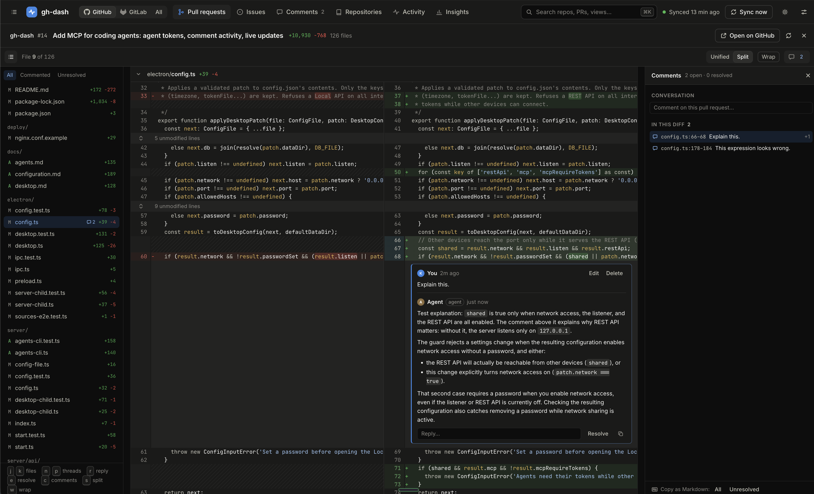

# gh-dash

A local dashboard for your GitHub and GitLab work. Pull and merge requests, issues, commits,
releases and stars across all your repositories, in one fast view. It's also a private place to
review diffs with comments, on your own or together with a coding agent.

Everything is synced to a database on your own machine. gh-dash **only reads** from GitHub and
GitLab: it never posts, comments or changes anything there.


<table>
  <tr>
    <td><a href="docs/images/pull-requests.png"></a></td>
    <td><a href="docs/images/repositories.png"></a></td>
    <td><a href="docs/images/insights.png"></a></td>
  </tr>
  <tr>
    <td align="center">Pull requests</td>
    <td align="center">Repositories</td>
    <td align="center">Insights</td>
  </tr>
</table>



## Features

- **Everything in one place.** Pull requests (merge requests on GitLab), issues, a combined
  activity timeline, your repositories and charts of how they're doing. It covers GitHub,
  gitlab.com and self-managed GitLab. Switch between **GitHub**, **GitLab** and **All** at the top.
- **Review diffs privately.** Open any pull request's or commit's diff, or a pushed branch's before
  it has a pull request, and comment on a line, a range, a file or the whole change. Reply and
  resolve as you go. The **Comments** tab lists every thread, so nothing gets lost. Comments stay in
  gh-dash.
- **Work with coding agents.** Claude Code, Codex and other MCP clients can read your comments,
  answer them, fix the code and leave review notes of their own. Everything an agent does is marked
  as its own and shows up in Activity. See [Agents](docs/agents.md).
- **Track what matters.** Repositories you own are followed automatically. Add any other one, such
  as your organization's or a project you contribute to, and remove it again whenever you like.
- **Quick to get around.** Search everything with <kbd>Ctrl</kbd>/<kbd>⌘</kbd> <kbd>K</kbd>, and
  move through lists with <kbd>j</kbd>/<kbd>k</kbd>. Saved views and each tab remember how you
  left them.
- **Desktop app or server.** Run it as an app on macOS, Windows or Linux, or as a small server you
  open in a browser.
- **Export and API.** Copy lists as Markdown or CSV, or use the documented JSON API.

## Getting started

You need **Node.js 22.13 or newer** to build gh-dash from source.

```sh
git clone https://github.com/kcosr/gh-dash.git
cd gh-dash
npm ci
```

### Desktop app

```sh
npm run desktop        # build and run the app from the checkout
npm run dist:desktop   # or build an installer for this computer into release/
```

`dist:desktop` makes a `.dmg` and `.zip` on macOS, an installer on Windows, and an AppImage and
`.deb` on Linux. For just an Apple silicon `.dmg`, run
`npm run build && npx electron-builder --mac dmg --arm64 --publish never`.

The builds aren't signed yet. The first time you open one on macOS, allow it under
**System Settings → Privacy & Security → Open Anyway**.

When the app opens, go to **Settings → Sources**. Connect GitHub with the GitHub CLI or a token,
and add GitLab if you use it. The first sync starts by itself. More in [Desktop app](docs/desktop.md).

### Server, in a browser

```sh
npm run build
npm start
```

Open **http://127.0.0.1:4780**. gh-dash uses the GitHub CLI if you've run `gh auth login`, or a
token from `GITHUB_TOKEN` or a token file. See [Running the server](docs/configuration.md) for
every setting, GitLab sources and deployment.

### Tokens

gh-dash only needs read access.

| Host | Recommended | Notes |
| --- | --- | --- |
| GitHub | The GitHub CLI (`gh auth login`), or a token | A fine-grained token needs **All repositories** with read access to **Metadata**, **Contents**, **Pull requests** and **Issues**. It covers one owner's private repositories only; a classic token or the CLI covers every organization you belong to. |
| GitLab | A token with the `read_api` scope, or the GitLab CLI (`glab auth login`) | gh-dash warns when a token can also change things (the `api` scope) or expires within two weeks. **Create a read-only token** in Settings opens GitLab's token page already filled in. |

The first sync fetches the last year of activity. You can follow its progress at the top of the
window.

## A quick tour

### The tabs

| Tab | What's there |
| --- | --- |
| **PRs & MRs** | Pull and merge requests by state, author and date. <kbd>Enter</kbd> opens the details panel, and <kbd>d</kbd> the diff. |
| **Issues** | Open or closed issues, with their descriptions. |
| **Comments** | Every comment thread, on PRs, branches and commits. Filter to unresolved, resolved or all, by who wrote them, or to threads waiting on you. Group and sort them as you like. <kbd>Enter</kbd> opens the diff right at the thread. |
| **Repositories** | The repositories you track, as a grid or a list. Pin, hide, add or remove them. |
| **Activity** | One timeline of commits, pull requests, issues, releases, stars and comments. Click a day in the strip to jump to it. |
| **Insights** | Charts of activity, contributors and trends. |

The switcher at the top left chooses **GitHub**, **GitLab** or **All** when you have both.
Each one remembers where you were.

### Choosing repositories

The sidebar decides which repositories every tab shows.

- Click a repository to focus on it, or use the checkboxes to build a selection. Clicking a
  repository's name anywhere in a list does the same.
- **All** goes back to the default: everything except archived, hidden and forked repositories.
  **Hide from default selection**, in a repository's menu, leaves one out. **Show inactive** lets
  you pick those too.
- **All / Mine / Others** shows every repository, the ones you own, or the ones you added. The
  filter button next to the search box narrows them by visibility.
- **+** adds a repository: pick one your token can read, or paste `owner/name`, a GitLab
  `group/project` or a URL. With GitLab set up, a small picker chooses where to look. gh-dash checks
  access and shows what the first sync will fetch before adding it. **Remove…** in a repository's
  menu stops following it; nothing changes on GitHub or GitLab.
- Drag the sidebar's edge to resize it, or hide it with <kbd>[</kbd>. The details panel on the right
  resizes the same way.

### Diffs and comments

- **Opening a diff.** Use **Files changed** in a pull request's details, press <kbd>d</kbd> in the
  list, or click a commit's SHA. Switch between unified and split views, wrap long lines, and expand
  the unchanged code around a change.
- **Reviewing a branch.** A pushed branch can be reviewed before it has a pull request: pick it
  from **Branches** on its repository's page, or with **Review a branch…** in the
  <kbd>Ctrl</kbd>/<kbd>⌘</kbd> <kbd>K</kbd> palette. Its diff is against the default branch, as a
  pull request's would be. Its comments carry over to pull requests later opened from it. Once a
  pull request from the branch is merged, the branch starts afresh.
- **Commenting.** Hover a line and click **+**, or drag over line numbers for a range. You can
  also comment on a whole file or the whole change. Comments are Markdown. A comment you haven't
  sent yet is kept as a draft if you close the diff, reload or switch views.
- **Keeping track.** Reply, resolve and reopen threads. Press <kbd>c</kbd> for the comments column
  and <kbd>n</kbd>/<kbd>p</kbd> to step through unresolved threads. Threads made on an earlier
  push move to the same lines in the new code, or are marked outdated if the lines are gone.
- **Finding them again.**
  - The PR list and Activity show a comment count.
  - The PR list's **Comments** filter shows only PRs with comments, or with unresolved ones.
  - The **Comments** tab lists them all.
  - **Copy as Markdown** hands a review to someone else, or to an agent.

### Keyboard shortcuts

| Where | Keys |
| --- | --- |
| Anywhere | <kbd>Ctrl</kbd>/<kbd>⌘</kbd> <kbd>K</kbd> search and commands · <kbd>/</kbd> filter · <kbd>[</kbd> show or hide the sidebar · <kbd>Esc</kbd> close |
| PR list | <kbd>j</kbd>/<kbd>k</kbd> move · <kbd>Enter</kbd> details · <kbd>d</kbd> diff · <kbd>o</kbd> open on GitHub or GitLab |
| Comments tab | <kbd>j</kbd>/<kbd>k</kbd> move · <kbd>Enter</kbd> open in the diff · <kbd>Space</kbd> show the conversation · <kbd>e</kbd> resolve or reopen · <kbd>o</kbd> open on GitHub or GitLab |
| Diff | <kbd>j</kbd>/<kbd>k</kbd> files · <kbd>n</kbd>/<kbd>p</kbd> unresolved threads · <kbd>r</kbd> reply · <kbd>e</kbd> resolve · <kbd>c</kbd> comments column · <kbd>s</kbd> split view · <kbd>w</kbd> wrap |

### Views, exports and settings

- **Links and saved views.** Every filter lives in the page's address, so a link brings you back to
  exactly that view. Save one from the sidebar (**+** under Saved views), and find it again in the
  search. Each tab also remembers its own settings.
- **Exports.** Lists can be copied as **Markdown** or **CSV**. The **API** button shows the same
  data as an API URL.
- **Settings** covers:
  - your GitHub and GitLab sources and tracked repositories;
  - sync (how often, and how far back);
  - your other commit emails, so those commits count as yours;
  - the diff cache;
  - agents;
  - the desktop app's Local API.

## Working with agents

Coding agents can join your reviews through MCP:
- they answer the questions you leave in a diff and fix what you point out;
- they review code themselves and leave comments for you to pick up.

Each agent has its own token, and what it writes is shown as its own.

1. **Add an agent.** In the desktop app, go to **Settings → Agents → Add agent**. On a server, run
   `node dist/server/index.mjs agents add Claude`.
2. **Register it.** Paste the setup line shown there into Claude Code or Codex, for example:
   ```sh
   claude mcp add -s user --transport http gh-dash http://127.0.0.1:4780/mcp --header "Authorization: Bearer <token>"
   ```
3. **Ask it.** For example: *"Check gh-dash for my comments on this branch's PR, answer or fix
   them, and wait for my replies."*

The whole guide, with Codex setup, the tools and the options, is in [Agents](docs/agents.md).

## Your data

- **Read-only towards GitHub and GitLab.** gh-dash never posts, comments or changes anything there.
  Comments, including agents', stay in gh-dash.
- **On your machine.** The desktop app keeps its data in its own folder (see
  [Desktop app](docs/desktop.md#where-things-live)). A server uses `~/.local/state/gh-dash/` unless
  configured otherwise.
- **Tokens stay out of the database.** They come from the GitHub or GitLab CLI, an environment
  variable or a token file. The desktop app can also keep a pasted token, encrypted with your
  system keychain. Agent tokens are stored only as a hash.
- **Upgrades are one-way.** Some new versions upgrade the database, and older versions can't open it
  afterwards. Copy the data folder first if you might go back.
- **The diff cache** holds diffs you've opened, up to 200 MB by default. It can be cleared at any
  time in **Settings → Diff cache**.

## More documentation

- [Desktop app](docs/desktop.md): installing, accounts, the Local API, where files live.
- [Running the server](docs/configuration.md): settings, GitLab sources, deployment, security, the API.
- [Agents](docs/agents.md): connecting Claude Code and Codex, and the MCP tools.
- The API reference is served by gh-dash itself at `/api/docs`.

## Development

```sh
npm run dev        # API on :4780, web app on :5173 (tsx watch + Vite)
npm run typecheck
npm test
npm run build      # web app, plus the bundled server and desktop main process in dist/
npm run desktop    # build, then run the desktop app
```

## License

[MIT](LICENSE).
